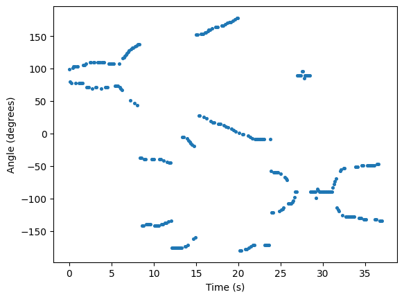

**Notes on the WSL Setup**

- WSL 2 does not work, since it changes the subnet of the ports. The ethernet port must have the same subnet as the router (a mask of 255.255.255.0, in this case). Only WSL 1 works.
- ```source devel/setup.bash``` must be run in every new terminal to register the wiros package with ros. I'd suggest assing it to ```.bashrc```.

**Running the Nodes**
- To launch the csi node, run the command ```roslaunch wiros_csi_node reciever.launch``` with the corresponding launch file for the router. The receiver file was configured to work on the 

**Router Setup**

I used two ASUS RT_AC86u routers to transmit and receive signals. 

**Introduction**

My main goal with this project was to make a workflow to easily get the angle of arrival (AOA) measurements and test their accuracy. For this, I used WCSNG @ UCSD's ```WiROS``` library. ```WiROS``` has multiple Robot Operating System (ROS) nodes that publish csi data, as well as multiple algorithms to help process the data.

**Experiments**

The first experiments I did were to test the accuracy of the AOA measurements. I launched, recorded, and plotted data from the AOA node as I gradually rotated the reciever so that the angle went from around positive 90 degrees to negative 90 degrees:



Every point on the graph is an angle estimation for a given reading. The AOA node tends to be unable to distinguish between $\theta$, $-\theta$, $180 - \theta$, and $\theta - 180$.

Next, I tried getting more information about the angle of arrival calculations. I ran their AOA algorithm manually, which, for each packet, calculates how well each angle matched, and plotted the entire curve for each packet recieved.


Each plotted curve corresponds to the profile for a different packet. In this case, I collected data for the reciever facing the transmitter roughly head on. Notice that, again, the algorithm fails to distinguish between angles near 0 degrees and those near 180 degrees.

I then redid the time vs angle plot as a heatmap, where warmer colors at a given time and angle indicate that the csi data for the reading at that time match the angle better. I reran the same experiment twice, where I rotated the angle of arrival from 90 degrees to -90 degrees. I also used the MUSIC algorithm, as it tended to give more focused results.

*Experiment 1*


*Experiment 2*


In both experiments, the most effective angle measurements were those with smaller magnitudes, seen in the centers of each graph.

Each packet recieved is actually 50 signals recieved on separate subcarriers. I modified their MUSIC and AOA algorithms to that they would work with an arbitrary subset of the subcarriers. Here's a gif I made of the MUSIC algorithm working with more and more data:


The final experiment I did was to check how both algorithms (AOA and MUSIC) worked when there were multiple angles of arrival.
I first recorded control data for one dominant signal path at 0 degrees:


The following two graphs are the data from me holding an aluminum reflector at a small positive angle and a small negative angle from the receiver.


(Note: in the positive angle case, there were some desks in the way, which might explain the weaker reading) In the negative angle case, the algorithm clearly detects a secondary angle.

Strangely, MUSIC did not perform as well:


